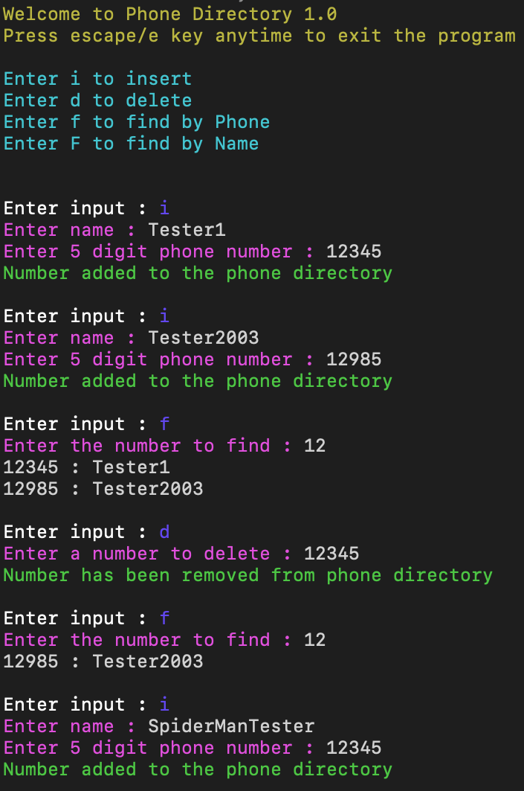
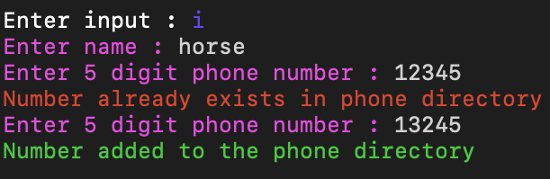

# Phone-Directory
 The Phone Directory project showcases my proficiency in C++ programming, highlighting skills in memory management through pointers, the application of Object-Oriented Programming (OOP) concepts, and the utilization of complex data structures, including trie, hashmaps, and sets. In this project, I designed and implemented an efficient phone directory system with features such as insertion, deletion, and search functionalities.

## Overview
You can Insert, Delete, Search your number by partially entering your name or number.

The console will autocomplete the partial information and then show the complete name/phone number you were trying to find.

## Key Features

### Object-Oriented Design:
Utilizes OOP principles for organizing code into classes and objects, promoting modularity and maintainability.

### Memory Management:
Demonstrates effective memory management using pointers to handle dynamic data structures and optimize resource usage.

### Data Structures:
Implements trie data structures for efficient auto-complete functionality.
Utilizes hashmaps and sets for organizing and searching phone numbers and names.

### Auto-Complete and Search:
Allows users to insert, delete, and search for numbers by partially entering names or numbers.
Utilizes auto-complete to predict and display complete names or phone numbers based on partial information entered by the user.

## Installation
To run the code, Make sure you have the following tools installed before running the program:
- C++ compiler/g++ on Mac

Steps:
- Clone the repository
 ```git clone git@github.com:ArshdeepSingh98/Phone-Directory.git```
- Navigate to the project directory
```cd Phone-Directory``` 
- Compile the C++ program
```g++ -std=c++11 -o mainRunnable main.cpp```
- Execute the program
```./mainRunnable```

## Screenshots
Example of inserting, deleting, finding:


<br>
Example of conflicting inserts: <br>
